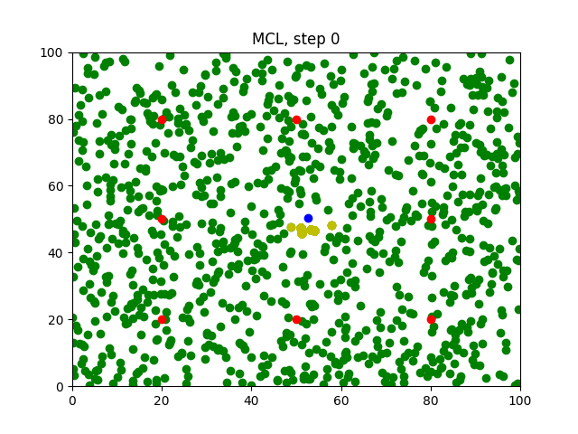
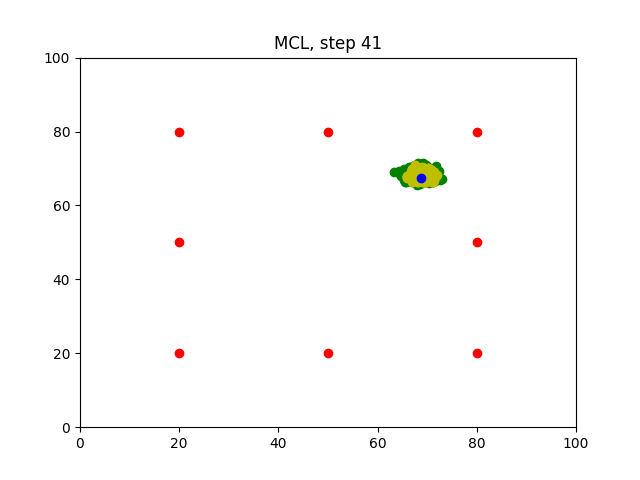

# RoboND-MCL-Lab

### Information
Sample implementation of Monte Carlo Localization Algorithm for learning purposes. 
This laboratry is part of the Robotics Software Engineering Nanodegree from Udacity and the original repository can be found in the link https://github.com/udacity/RoboND-MCL-Lab

### Main changes: 
* Ploted images directory
* Add Makefile 
* Add "define" statements for main parameters

### Build and Run

```bash
make
./mcl
```

### Results
Images are generated in the `img` folder.

#### Step 0
Random particles with uniform distribution are generated.


#### Step 41
Particles converge towards the robot.


### Improvements
* Plot orientation on graph
* Plot error in graph
* Change robot move to random
* Change Makefile to create `img` folder
* Generate animation with images
* Adjust .gitigoner
